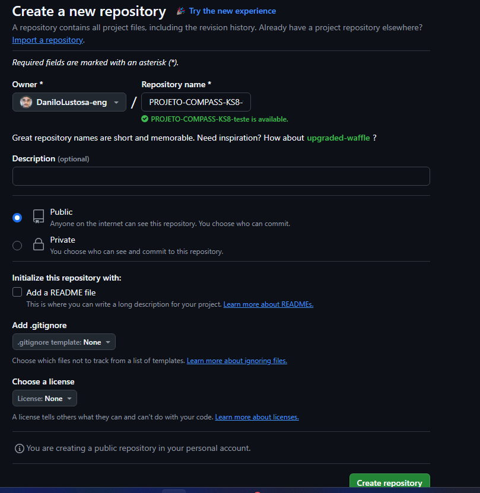
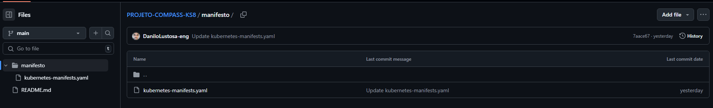
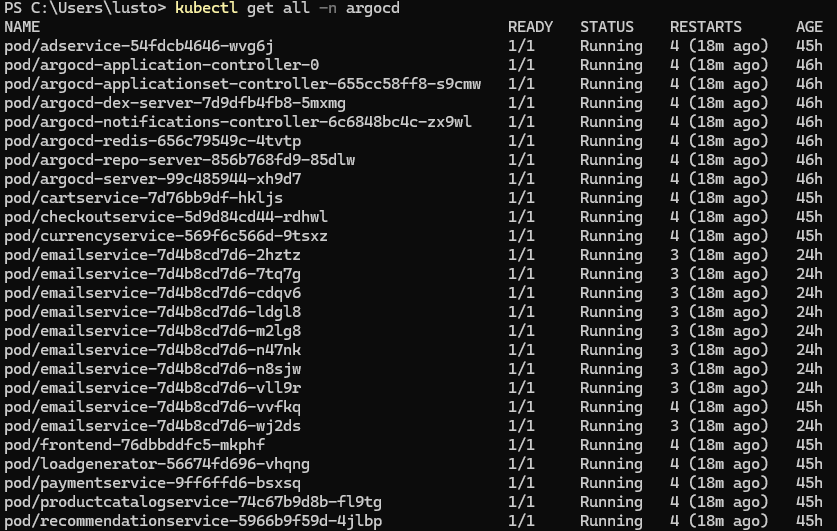
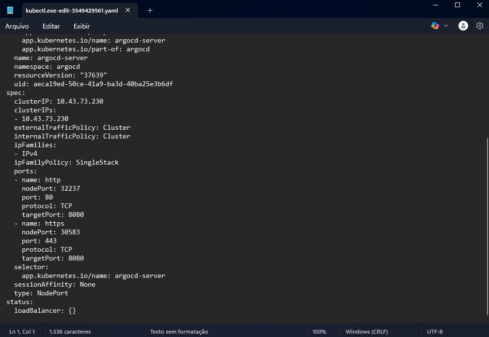
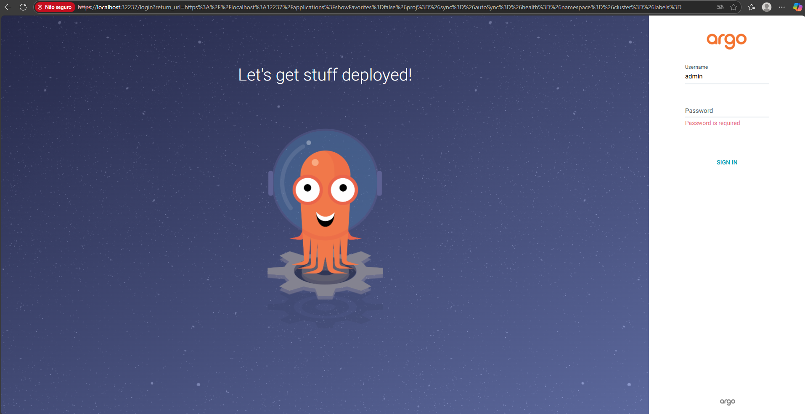
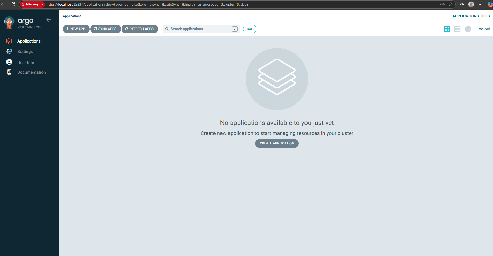
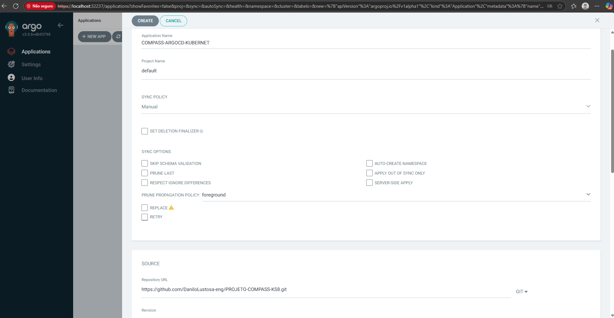
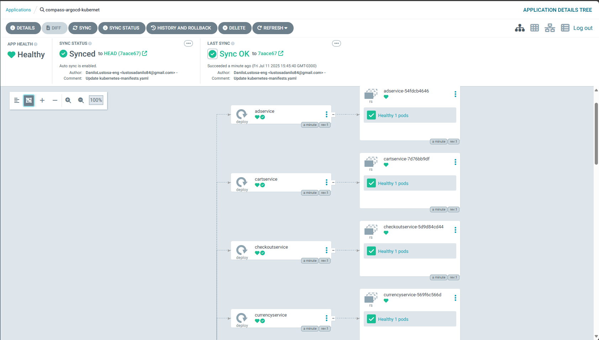
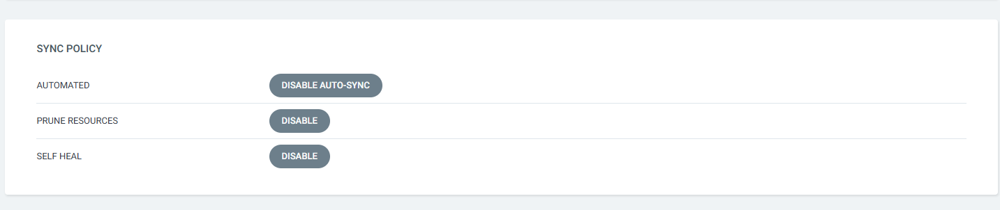
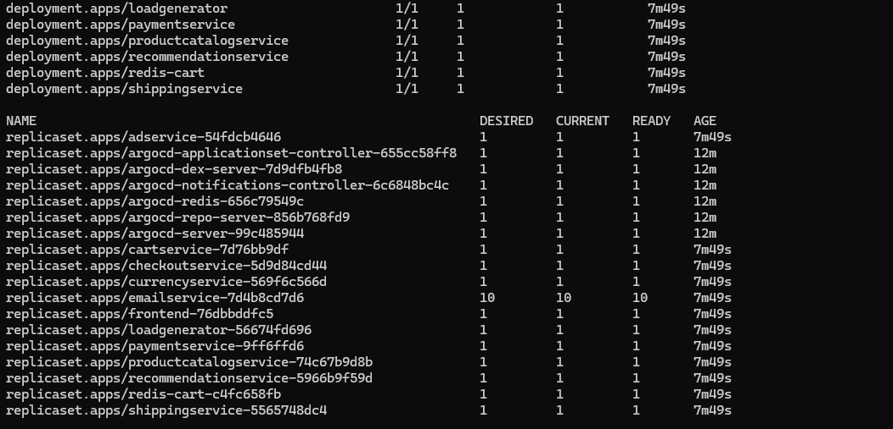

# 🛞PROJETO-COMPASS-KS8-ARGOCD🦑
##  Introdução 📜
## Projeto desenvolvido com o objetivo de aprofundar os conhecimentos em Kubernetes e Argo CD, explorando na prática conceitos como deploy contínuo, GitOps e automação de aplicações em ambientes orquestrados. A iniciativa visa consolidar o uso de ferramentas modernas de entrega contínua e infraestrutura como código para ambientes escaláveis e resilientes.
## Tecnologias Utilizadas 🛠️
- **Kubernetes**: Plataforma de orquestração de contêineres para automação de deploy, escalabilidade e gerenciamento de aplicações.
- **Argo CD**: Ferramenta de entrega contínua para Kubernetes, que implementa o conceito de GitOps, permitindo gerenciar aplicações Kubernetes através de repositórios Git.
- **Rancher-desktop**: Plataforma para desenvolvimento local de aplicações em Kubernetes, facilitando a criação e gerenciamento de clusters.
- **Repositorio usado como fonte**: [link do repositorio](https://github.com/DaniloLustosa-eng/microservices-demo)

## 1. criação do repositorio público no github
- Acesse o GitHub e crie um novo repositório chamado PROJETO-COMPASS-KS8 `
## 1.1 Clonando o repositório
- Acesse o repositório fonte e transfira o arquivo **kubernetes-manifests.yaml** para uma pasta chamada **manifesto** no repositório que você criou..
## 2. Configuração do Argo CD
- Instale o Argo CD no seu cluster Kubernetes. Você pode seguir a [documentação oficial do Argo CD](https://argo-cd.readthedocs.io/en/stable/getting_started/) para obter instruções detalhadas.
- comandos para isntalação do Argo CD:
```
kubectl create namespace argocd
kubectl apply -n argocd -f https://raw.githubusercontent.com/argoproj/argo-cd/stable/manifests/install.yaml
```
- Usando o comando abaixo, você pode verificar se o Argo CD foi instalado corretamente:
```
kubectl get all -n argocd
```

## 3. Acessando o Argo CD
- Para acessar a interface do Argo CD, você pode usar o seguinte comando para obter o endereço IP do serviço:
```
kubectl get svc -n argocd
```
- Em seguida, abra o navegador e acesse o endereço IP do serviço Argo CD na porta do serviço **argocd-server**
- Caso você não esteja conseguindo acessar o Argo CD, você pode usar o comando abaixo para mudar o atributo **type** do serviço: que pode estar como **ClusterIP** para **NodePort**:
```
kubectl patch svc argocd-server -n argocd -p '{"spec": {"type": "NodePort"}}'
```
- E para ter certeza que o serviço foi alterado, você pode usar o comando:
```
kubectl edit svc/argocd-server -n argocd
```
- Que mostrara está tela 
 
- Agora você pode acessar o Argo CD através do endereço IP do seu cluster na porta especificada.

- o nome de usuário padrão é **admin** e a senha pode ser obtida com o seguinte comando no sistema operacional windows:
```
[System.Text.Encoding]::UTF8.GetString([System.Convert]::FromBase64String((kubectl -n argocd get secret argocd-initial-admin-secret -o jsonpath="{.data.password}")))
```
- ou no sistema operacional linux:
```
kubectl -n argocd get secret argocd-initial-admin-secret -o jsonpath="{.data.password}" | base64 --decode
```
- Após fazer login, você verá a interface do Argo CD.

## 4. Criando um Aplicativo no Argo CD
- No Argo CD, clique em **New App** para criar um novo aplicativo.
- Preencha os detalhes do aplicativo:
 
- Depois de preencher os detalhes do aplicativo, clique em **Create** para criar o aplicativo.

## 5. Sincronizando o Aplicativo
- Após criar o aplicativo, você verá a tela do aplicativo. Clique no botão **detailes**
- Habilite as politicas de sincronização

- Agora o Argo CD considera como fonte da verdade apenas o conteúdo do repositório Git, e não mais o estado atual do cluster. Com isso, o Argo CD sincroniza automaticamente quaisquer alterações feitas no repositório com o cluster Kubernetes.
- para testar a sincronização, você pode fazer uma alteração no arquivo **kubernetes-manifests.yaml** no repositório Git e verificar se o Argo CD detecta a alteração e atualiza o aplicativo no cluster Kubernetes.
- Agora, você pode vizualizar os seus pods e serviços criados no cluster Kubernetes usando o comando:
```
kubectl get all -n argocd
```
 
## 6. 🎉 Parabéns! Você conseguiu tornar sua aplicação segura e redundante, utilizando práticas de GitOps com o Argo CD, garantindo automação, controle de versão e consistência no ambiente Kubernetes.